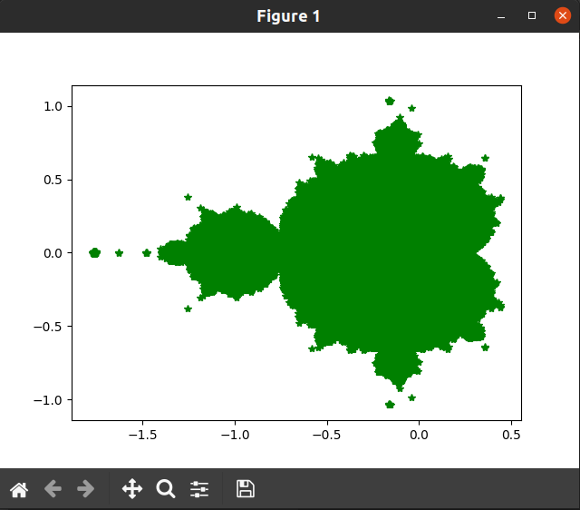

# Python mathematics

## Install
> Requires python3

```shell
$ pip3 install -r /path/to/requirements.txt
```

## Fractals

### Mandelbrot
Explanation: https://en.wikipedia.org/wiki/Mandelbrot_set

Command: 
```shell
$ python3 fractal.py mandelbrot
```

Result



### Burning Ship

Explanation: https://en.wikipedia.org/wiki/Burning_Ship_fractal

Command: 
```shell
$ python3 fractal.py ship
```

Result


## Sierpinski triangle
Explanation: https://en.wikipedia.org/wiki/Sierpi%C5%84ski_triangle

Command
```shell
$ python3 siepinski.py
```

Result


## Game of life
Explanation: https://en.wikipedia.org/wiki/Conway%27s_Game_of_Life

Command
```shell
$ python3 game_of_life.py
```

Result: iterations happens on terminal